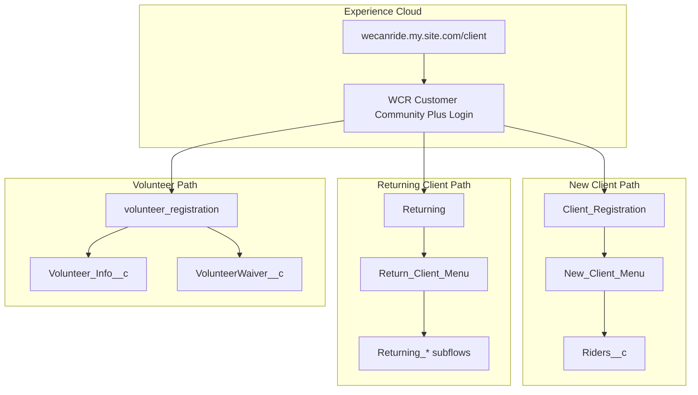

# We Can Ride Salesforce Project

Therapeutic horseback riding nonprofit (**We Can Ride, Inc.**) running on Salesforce Experience Cloud. This repo is a Salesforce DX project (`sourceApiVersion: 55.0`) with community-facing screen flows for client and volunteer self-service.

## Quick stats

| Artifact | Count | Registry |
|----------|-------|----------|
| Screen flows | 68 | [[manifests/flows-registry]] |
| Custom objects | 16 | [[manifests/objects-registry]] |
| Permission sets | 4 | [[community-access]] |
| LWC components | 1 | [[fsc-flow-button-bar]] |

## Architecture at a glance

## Key journeys

- [[client-journey]] — new client registration through `Client_Registration`
- [[volunteer-journey]] — volunteer onboarding and schedule selection
- [[returning-client-paperwork]] — annual returning paperwork via `Returning` router flow

## Cross-cutting concerns

- [[community-access]] — profiles, permission sets, flow run permissions
- [[flow-permissions]] — `isAdditionalPermissionRequiredToRun`, `Flow_User_Access`
- [[architecture]] — metadata layout and integration packages (NPSP, GW Volunteers, OneMerge)

## Community URLs

- Login: `https://wecanride.my.site.com/client/s/login`
- Internal Lightning: `https://wecanride.lightning.force.com/`

## How to use this wiki

See `AGENTS.md` in the repo root for ingest, query, and lint workflows. Start every query at [[index]].
