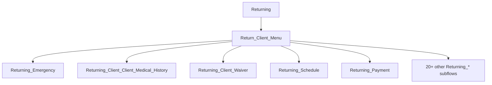

# Returning Client Paperwork

Annual renewal workflow for existing clients. Uses a **router + subflow** pattern.

## Router architecture

## Returning_* subflows (complete list)

| Flow | Form / purpose |
|------|----------------|
| `Returning_Emergency` | Emergency contact update |
| `Returning_Main_Info` | Main client information |
| `Returning_Parent_Guardian` | Parent/guardian details |
| `Returning_Height_Weight` | Height and weight update |
| `Returning_Client_Client_Medical_History` | Medical history form upload |
| `Returning_Seizure_Form` | Seizure form upload |
| `Returning_Down_Syndrome` | Down syndrome form upload |
| `Returning_File_Upload_Scoliosis` | Scoliosis form upload |
| `Returning_Client_Waiver` | Client waiver |
| `Returning_Authorization_Emergency_Medical_Treatment` | Emergency medical authorization |
| `Returning_Confidentiality_HIPPA` | HIPAA confidentiality |
| `Returning_Photo_Release` | Photo release |
| `Returning_Payment` | Payment policy |
| `Returning_Schedule` | Schedule form upload |
| `Returning_Schedule_Selection` | Schedule selection |
| `Returning_Riding_Lesson_Registration` | Riding lesson registration |
| `Returning_Therapy_Cancellation_Policy` | Therapy cancellation policy |
| `Returning_GroupHome` | Group home information |

## Permission requirements

Returning flows require [[community-returning-flow-access]] in addition to base [[flow-user-access]].

## Deep dive

- [[returning-emergency]] — most complex returning subflow (emergency contacts)
- [[concepts/returning-client-paperwork]] — concept-level documentation

## Related

- [[client-journey]] — initial registration path
- [[community-access]] — community permission model
